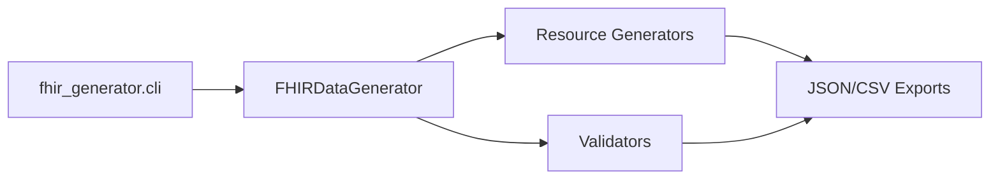

# Synthetic Medical Data (FHIR) Generator

The Synthetic Medical Data Generator produces realistic, privacy-safe HL7 FHIR R4 resources for testing, analytics, and simulations. It ships with a CLI for generating patients, encounters, observations, diagnoses, medications, and bundles, plus validation and export helpers.

## Features
- Generates core resources: `Patient`, `Encounter`, `Observation`, `Condition`, `MedicationRequest`, `Procedure`, `DiagnosticReport`, and optional `AllergyIntolerance`/`Practitioner`.
- Synthetic values only; no real identifiers or PII.
- Deterministic output via seedable randomness.
- CSV summaries and Bundle exports for rapid downstream use.
- Lightweight validation for structural correctness.
- Ready-to-run CLI with clean repository layout and examples.

## Quickstart
```bash
python -m venv .venv
source .venv/bin/activate
pip install -e .[dev]
fhir-gen create-dataset --count 3 --output output --csv
```

Generate a single patient:
```bash
fhir-gen create-patient --seed 1234 --output examples/example_patient.json
```

Bundle previously generated resources:
```bash
fhir-gen bundle --input output --output examples/example_bundle.json
```

## Architecture Overview
- `fhir_generator/main.py` – Orchestrates generation, bundling, and export routines via `FHIRDataGenerator`.
- `fhir_generator/cli.py` – Argparse-driven CLI exposing dataset creation, bundling, and seeding controls.
- `fhir_generator/generators/` – Resource-specific factories for patients, encounters, observations, conditions, medications, procedures, diagnostic reports, allergies, and practitioner helpers.
- `fhir_generator/validators/` – Lightweight validators for structural checks.
- `tests/` – Pytest-based smoke tests for key generators and bundle behavior.



## Usage reference

| Command | Description |
| --- | --- |
| `python -m fhir_generator.cli create-patient --seed 42 --output patient.json` | Generate a single patient and write to disk. |
| `python -m fhir_generator.cli create-dataset --count 5 --csv --output output/` | Create five patient folders plus a CSV summary. |
| `python -m fhir_generator.cli bundle --input output --output synthetic_bundle.json` | Bundle existing resources from an output directory. |

Resources are validated before export; invalid resources are skipped with warnings. Use `--verbose` to see debug-level logs during generation and validation.

## CLI Commands
- `create-patient` – Generate a single patient resource; optionally write to disk.
- `create-dataset --count <n>` – Create <n> patient record sets with bundles and optional CSV summary.
- `bundle` – Build a Bundle JSON from an output directory.
- Global options: `--seed`, `--output`, `--csv`, `--verbose`.

## Validation
Resources are checked for required fields and IDs before being written. Invalid resources are skipped with logged errors, ensuring only structurally sound FHIR assets reach disk.

## Outputs
- Individual JSON files per resource per patient folder in `output/`.
- A consolidated `synthetic_bundle.json` bundle.
- Optional CSV summary capturing demographics and vitals.

## Development
- Format/lint using `ruff` and `black` (config in `pyproject.toml`).
- Run tests via `pytest` or `make test`.
- Use `make check` to run formatting, linting, and tests together.
- Logging is enabled by default; use `--verbose` for debug-level detail.

Additional references:
- `docs/USAGE.md` for CLI and Python API details
- `docs/DEVELOPMENT.md` for environment setup, workflow, and release guidance

## Quality and CI
- Continuous Integration runs ruff, black (check mode), and pytest (see `.github/workflows/ci.yml`).
- All functions include docstrings and type hints to clarify expected shapes and contracts.

## Security and Privacy
All data is synthetic and randomly generated. No real-world identifiers or personal data are used. See `SECURITY.md` for reporting guidance.

## License
Released under the MIT License. See `LICENSE` for details.
