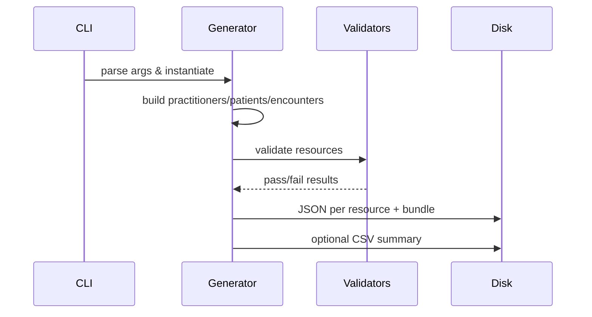

# Architecture Overview

The generator is composed of modular resource factories and a central `FHIRDataGenerator` orchestrator.

- **Generators (`fhir_generator/generators/`)** produce individual HL7 FHIR R4 resource dictionaries with realistic synthetic values and proper references.
- **Validation (`fhir_generator/validators/`)** enforces minimal structural requirements before export.
- **Orchestration (`fhir_generator/main.py`)** assembles complete patient stories, bundles resources, and handles disk exports and CSV summaries.
- **CLI (`fhir_generator/cli.py`)** exposes high-level commands for generating patients, datasets, and bundles.

Each generator uses shared utilities for UUIDs, codeable concepts, and consistent value distributions to maintain plausibility and referential integrity across resources.

## Key responsibilities

- **`fhir_generator.main.FHIRDataGenerator`**: central orchestrator that assembles patient-level resource collections, wraps them into Bundles, and exports JSON/CSV artifacts.
- **`fhir_generator.cli`**: thin CLI wrapper that validates arguments, toggles verbosity, and provides subcommands for dataset creation and bundling.
- **Validators**: perform structural checks on required fields and references before writing files to disk to avoid malformed outputs.

## Data flow

